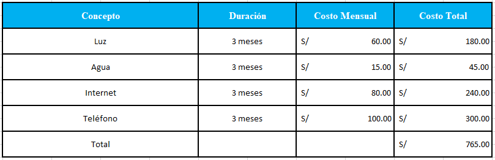

**\
UNIVERSIDAD PRIVADA DE
TACNA**{width="1.0926727909011373in"
height="1.468837489063867in"}

**FACULTAD DE INGENIERÍA**

**Escuela Profesional de Ingeniería de Sistemas**

**\
**

**"Proyecto *SEACE ProjectFinder"***

**Curso:**

*Inteligencia de Negocios*

**Docente:**

*Mag. Patrick Cuadros Quiroga\
*

> **Integrantes:**

*Akhtar Oviedo, Ahmed Hasan - (2022074261)*

*Anampa Pancca, David Jordan - (2022074268)*

*Salas Jimenez, Walter Emmanuel - (2022073896)*

**Tacna -- Perú**

*2025*

Sistema *SEACE ProjectFinder*

Informe de Factibilidad

Versión *1.0*

  ----------------------------------------------------------------------------------
  CONTROL DE                                                
  VERSIONES                                                 
  ----------- -------- ----------- ----------- ------------ ------------------------
  Versión     Hecha    Revisada    Aprobada    Fecha        Motivo
              por      por         por                      

  1.0         AAHV,    PCQ                     11/09/2025   Versión Original
              DDAP,                                         
              WESJ                                          
  ----------------------------------------------------------------------------------

**ÍNDICE GENERAL**

[1. Descripción del Proyecto 5](#descripción-del-proyecto)

> [1.1 Nombre del proyecto 5](#nombre-del-proyecto)
>
> [1.4.1 Objetivo general 6](#objetivo-general)
>
> [1.4.2 Objetivos Específicos 6](#objetivos-específicos)

[2. Riesgos 6](#riesgos)

[3. Análisis de la Situación actual 7](#análisis-de-la-situación-actual)

> [3.1 Planteamiento del problema 7](#planteamiento-del-problema)
>
> [3.2 Consideraciones de hardware y software
> 7](#consideraciones-de-hardware-y-software)

[4. Estudio de Factibilidad 8](#estudio-de-factibilidad)

> [Actividades realizadas: 8](#actividades-realizadas)
>
> [4.1 Factibilidad Técnica 8](#factibilidad-técnica)
>
> [4.2 Factibilidad Económica 8](#factibilidad-económica)
>
> [4.2.1 Costos Generales 9](#costos-generales)
>
> [4.2.2 Costos operativos durante el desarrollo
> 9](#costos-operativos-durante-el-desarrollo)
>
> [4.2.3 Costos del ambiente 9](#costos-del-ambiente)
>
> [4.2.4 Costos de personal 9](#costos-de-personal)
>
> [4.2.5 Costos totales del desarrollo del sistema
> 10](#costos-totales-del-desarrollo-del-sistema)
>
> [4.3 Factibilidad Operativa 10](#factibilidad-operativa)
>
> [4.4 Factibilidad Legal 11](#factibilidad-legal)
>
> [4.5 Factibilidad Social 11](#factibilidad-social)
>
> [4.6 Factibilidad Ambiental 12](#factibilidad-ambiental)

[5. Análisis Financiero 13](#análisis-financiero)

> [5.1 Justificación de la Inversión 14](#justificación-de-la-inversión)
>
> [5.1.1 Beneficios del Proyecto 14](#beneficios-del-proyecto)
>
> [a) Beneficios Tangibles 14](#beneficios-tangibles)
>
> [b) Beneficios Intangibles 14](#beneficios-intangibles)
>
> [5.1.2 Criterios de Inversión 15](#criterios-de-inversión)

[6. Conclusiones 18](#conclusiones)

**Informe de Factibilidad**

1.  # Descripción del Proyecto 

    1.  ## Nombre del proyecto

SEACE ProjectFinder

2.  **Duración del proyecto**

> 4 meses.

3.  **Descripción**

> El sistema SEACE ProjectFinder será implementado como una solución
> tecnológica orientada a transformar la información pública disponible
> en la plataforma SEACE/OSCE en un catálogo de oportunidades de
> proyectos. Mediante técnicas de extracción de datos (scraping) y
> procesamiento con inteligencia artificial, se organizarán
> convocatorias, pliegos y anexos en un repositorio consultable con
> filtros avanzados.
>
> El sistema permitirá que los usuarios soliciten proyectos con detalles
> específicos a través de un chatbot, el cual empleará técnicas de
> recuperación de información (RAG + embeddings) para recomendar
> proyectos de acuerdo con el perfil profesional y los recursos
> disponibles. Asimismo, integrará un dashboard en Power BI para mostrar
> indicadores clave de gestión (KPIs) y facilitar la priorización de
> oportunidades.
>
> El proyecto busca reducir la complejidad en el acceso y análisis de
> los procesos publicados en SEACE, ofreciendo a los ingenieros de
> sistemas y profesionales afines una plataforma clara, visual e
> interactiva para identificar demandas reales del Estado y
> transformarlas en ideas de proyectos, consultorías o prototipos
> viables.

4.  **Objetivos\
    > **

    1.  ### Objetivo general

> Desarrollar una plataforma inteligente que extraiga, procese y
> organice datos de SEACE, ofreciendo a los ingenieros de sistemas un
> catálogo de oportunidades de proyectos con filtros avanzados.

### Objetivos Específicos

-   Extraer y almacenar registros públicos relevantes del SEACE

-   Facilitar la toma de decisiones basada en datos.

-   Implementar un asistente virtual para consultas en lenguaje natural.

-   Simplificar la búsqueda y navegación de procesos SEACE.

-   Brindar una interfaz intuitiva para que el usuario acceda de manera
    > eficiente a la información.

# Riesgos

-   La calidad de los datos en SEACE puede ser inconsistente o ambigua,
    > afectando la extracción y el procesamiento.

-   Cambios en la plataforma SEACE/OSCE podrían interrumpir el scraping
    > y requerir ajustes técnicos.

-   El volumen de datos históricos puede generar sobrecarga y afectar el
    > rendimiento del sistema.

-   El NLP puede presentar errores en la clasificación de rubros o en la
    > extracción de requerimientos técnicos.

-   Existe riesgo de baja adopción por parte de usuarios que prefieran
    > métodos tradicionales de búsqueda.

3.  # Análisis de la Situación actual 

    1.  ## Planteamiento del problema

> Actualmente, los procesos y requerimientos publicados en SEACE
> contienen problemáticas y demandas concretas del Estado, pero
> presentan dificultades que limitan su aprovechamiento. La información
> se encuentra dispersa y disponible únicamente en formatos técnicos
> extensos como pliegos y anexos, lo que dificulta su consulta. Además,
> los ingenieros de sistemas no cuentan con una interfaz visual que
> resuma y priorice estas oportunidades, ni con un mecanismo ágil que
> permita transformar dichos registros en enunciados técnicos y acciones
> de desarrollo viables. Esta situación evidencia la necesidad de una
> solución que organice y traduzca la información de SEACE en
> oportunidades claras, filtrables y accionables para los profesionales
> del sector.

## Consideraciones de hardware y software

-   Hardware:

    -   *Servidor con mínimo 8 GB de RAM y 100 GB de almacenamiento
        > SSD.*

    -   *Acceso estable a Internet.*

    -   *Equipos cliente con navegador actualizado y conexión de red
        > funcional.*

    -   *Despliegue en contenedores mediante Docker.\
        > *

```{=html}
<!-- -->
```
-   *Software:*

    -   *Lenguaje backend: **TypeScript / C#***

    -   *Framework frontend: **Next.js***

    -   *Framework frontend UI: **React***

    -   *Base de datos: **PostgreSQL***

    -   *Cache y soporte de búsqueda: **Redis***

    -   *Generación de reportes y visualización: **Power BI***

    -   *Motor de recomendación: **NLP + embeddings (RAG)***

    -   *Backend API: **FastAPI***

    -   *Núcleo de IA: **Gemini API***

# Estudio de Factibilidad 

> El estudio de factibilidad tiene como finalidad determinar la
> viabilidad de implementar el sistema SEACE ProjectFinder. Para ello,
> se evaluaron aspectos técnicos, económicos, operativos, legales,
> sociales y ambientales.

### *Actividades realizadas:*

-   *Análisis de tecnologías disponibles (scraping, NLP, RAG, Power
    > BI).*

-   *Diseño de flujos de interacción para usuarios que no están
    > familiarizados con procesos de SEACE.*

-   *Revisión de herramientas de procesamiento de lenguaje natural y
    > motores de recomendación.*

-   *Validación de la propuesta con profesionales en ingeniería de
    > sistemas interesados en oportunidades de SEACE.*

> La evaluación determinó que la herramienta es viable, tanto técnica
> como económicamente, con un alto potencial de impacto positivo en la
> identificación y priorización de proyectos reales.

## Factibilidad Técnica

> El proyecto cuenta con tecnologías modernas y ampliamente utilizadas.
> El uso de TypeScript, Next.js, PostgreSQL y Redis garantiza un entorno
> escalable y eficiente, mientras que la integración de Power BI
> facilita la analítica visual. El personal técnico de DevStar Solutions
> posee experiencia en ETL, modelado de datos y despliegue en Docker, lo
> cual asegura la implementación en la infraestructura prevista.

## Factibilidad Económica

> El análisis preliminar muestra que la inversión requerida es moderada
> frente al valor generado: reducción de tiempos de análisis, mejora en
> la calidad de los entregables y creación de un producto con potencial
> de ser replicado o escalado en otras instituciones. La relación
> costo-beneficio resulta favorable, pues el sistema optimiza procesos y
> abre oportunidades de innovación aplicada en el sector público.

### Costos Generales 

  -----------------------------------------------------------------------
  Concepto                       Duración    Costo Mensual   Costo Total
  ------------------------------ ----------- --------------- ------------
  Licencia de ofimática básica   3 meses     S/. 23.36       S/.70

  Licencia de software de        3 meses     s/. 20          S/.60
  diagramado                                                 

  Total                                                      S/. 130
  -----------------------------------------------------------------------

### Costos operativos durante el desarrollo  

{width="5.770833333333333in"
height="1.8625437445319335in"}

### Costos del ambiente

  ------------------------------------------------------------------------
  Concepto                   Duración      Costo Mensual    Costo Total
  -------------------------- ------------- ---------------- --------------
  Dominio y Hosting          3 meses       S/. 20           S/.60

  Servidor FTP               3 meses       s/. 25           S/.75

  Total                                                     S/. 135
  ------------------------------------------------------------------------

### Costos de personal

  ------------------------------------------------------------------------
  Concepto                   Duración      Costo Mensual    Costo Total
  -------------------------- ------------- ---------------- --------------
  Project Manager            3 meses       S/. 30           S/.90

  Back End                   3 meses       S/. 30           S/.90

  DevOps                     3 meses       S/. 30           S/.90

  Total                                                     S/. 270
  ------------------------------------------------------------------------

###  

### Costos totales del desarrollo del sistema 

### 

  -----------------------------------------------------------------------
  Concepto                                            Monto
  --------------------------------------------------- -------------------
  Costos Generales                                    S/. 130

  Costos Operativos                                   S/. 765

  Costos del Ambiente                                 S/. 135

  Costos del Personal                                 S/. 270

  Total General                                       S/.1300
  -----------------------------------------------------------------------

### 

## Factibilidad Operativa

> *El sistema **SEACE ProjectFinder** se diseñó con el objetivo de ser
> una plataforma funcional, escalable y de fácil adopción para los
> usuarios. Se implementará en un entorno en la nube mediante AWS y
> contenedores Docker, lo que asegura portabilidad y un bajo costo de
> mantenimiento. Además, los equipos técnicos de ingeniería de sistemas
> cuentan con la experiencia necesaria en tecnologías como TypeScript,
> Next.js, PostgreSQL y Redis, lo que facilita la integración y puesta
> en marcha del sistema.*

#### *✔ Beneficios operativos: *

-   *Disminución del tiempo invertido en la búsqueda y análisis de
    > convocatorias públicas.*

-   *Reducción de errores en la identificación de oportunidades por
    > dispersión de la información.*

-   *Mejora de la comunicación entre profesionales al contar con un
    > catálogo consultable y filtros avanzados.*

-   *Incremento en la eficiencia del análisis de datos mediante NLP y
    > visualizaciones en Power BI.*

#### *✔ Lista de interesados: *

-   *Ingenieros de sistemas y profesionales que buscan oportunidades de
    > proyectos reales.*

-   *Docentes y grupos de investigación interesados en problemáticas
    > públicas.*

-   *Empresas tecnológicas que deseen alinear sus propuestas con
    > demandas estatales.*

-   *Áreas de innovación y desarrollo de instituciones académicas y
    > privadas.*

    1.  ## Factibilidad Legal

> *Se ha revisado el cumplimiento del proyecto con respecto a las normas
> legales locales e internacionales:*

#### *✔ Puntos cubiertos:*

-   *La información utilizada proviene exclusivamente de SEACE/OSCE y
    > corresponde a registros públicos, por lo que no se comprometen
    > datos personales sensibles.\
    > *

-   *La plataforma cumple con regulaciones básicas de **protección de
    > datos (GDPR/LPDP)**, al almacenar únicamente la información
    > necesaria y permitir su eliminación bajo requerimiento.\
    > *

-   *Todas las tecnologías empleadas (PostgreSQL, Redis, Next.js,
    > FastAPI, etc.) son de **licencia libre o comercialmente
    > permitidas** dentro del marco de uso del proyecto.*

    1.  ## Factibilidad Social

> *Desde el punto de vista social y organizacional, **SEACE
> ProjectFinder** aporta un valor significativo al transformar
> información compleja y dispersa en oportunidades claras de
> desarrollo.*

#### *✔ Aspectos sociales evaluados:*

-   ***Aceptación interna**: Se prevé buena recepción por parte de los
    > ingenieros de sistemas y profesionales del sector, ya que responde
    > directamente a la necesidad de identificar y priorizar proyectos
    > reales.\
    > *

-   ***Capacitación mínima**: El sistema incluye una interfaz sencilla
    > (chatbot + dashboard), lo que reduce la curva de aprendizaje.\
    > *

-   ***Impacto en la cultura de trabajo**: Fomenta el uso de tecnologías
    > de analítica, NLP y visualización para impulsar una cultura de
    > innovación basada en datos públicos.*

    1.  ## Factibilidad Ambiental

> *El sistema requiere un entorno tecnológico adecuado para garantizar
> estabilidad y disponibilidad de los servicios. La decisión de
> desplegarlo en la nube (AWS) mediante Docker permite optimizar los
> recursos y reducir la huella física de infraestructura.*

#### *✔ Requerimientos técnicos mínimos:*

-   ***Dominio web**: Necesario para acceder al sistema SEACE
    > ProjectFinder.\
    > *

-   ***Servidor FTP**: Donde se almacenarán los documentos generados,
    > disponibles para su descarga.\
    > *

-   ***Base de datos**: PostgreSQL y Redis en la nube para almacenar y
    > gestionar registros procesados.\
    > *

-   ***Capacidad de almacenamiento**: Al menos 100 GB disponibles,
    > escalables según el uso.*

-   ***Integración:** Integración con Power BI para visualización y
    > análisis de KPIs.*

# Análisis Financiero

> Para garantizar la viabilidad del sistema **SEACE ProjectFinder**, se
> elaboró un análisis financiero con horizonte de 12 meses, considerando
> la inversión inicial y los ingresos/egresos proyectados.
>
> El análisis financiero determina la viabilidad económica del proyecto
> a través de tres indicadores principales: Relación Beneficio/Costo
> (B/C), Valor Actual Neto (VAN) y Tasa Interna de Retorno (TIR).
>
> **Supuestos financieros básicos**
>
> Horizonte de evaluación: 12 meses
>
> Inversión inicial del proyecto: S/. 1,297.00
>
> Tasa de descuento (COK): 6.5% anual (equivalente a 0.526% mensual)
>
> Ingresos mensuales estimados: S/. 11,800.00
>
> Egresos mensuales estimados: S/. 9,600.00
>
> Por otro lado, los ingresos proyectados están directamente
> relacionados con los beneficios que obtendremos mediante el uso del
> sistema. Entre estos beneficios se encuentran:

-   Reducción de hasta un 60% del tiempo que actualmente invierten los
    > profesionales en la búsqueda y análisis manual de convocatorias
    > públicas.

-   Disminución del riesgo de errores de interpretación, gracias al
    > filtrado automático y a la clasificación con técnicas de NLP.

-   Generación ágil de formatos y reportes estandarizados (PDF, Excel,
    > Power BI) con mínima intervención manual.

-   Incremento de la productividad y eficiencia tanto en el análisis de
    > oportunidades como en la toma de decisiones estratégicas.

##     

## 

1.  ## Justificación de la Inversión

    1.  ### Beneficios del Proyecto

> La implementación de SEACE ProjectFinder generará beneficios tangibles
> e intangibles que fortalecen tanto a los profesionales como al
> ecosistema tecnológico.

a)  ### Beneficios Tangibles 

    -   Reducción de tiempo en la búsqueda y análisis de oportunidades
        > del SEACE.

    -   Optimización del uso del recurso humano en actividades de
        > filtrado y clasificación.

    -   Disminución de errores en la identificación de proyectos
        > viables.

    -   Reducción de costos operativos en procesos de exploración
        > manual.

    -   Incremento en la productividad de ingenieros y grupos de
        > investigación.**\
        > **

b)  ### Beneficios Intangibles 

    -   Mejora en la eficiencia de los procesos de selección de
        > proyectos.

    -   Disponibilidad de información organizada y trazable en tiempo
        > real.

    -   Aumento en la satisfacción de los usuarios al contar con
        > recomendaciones personalizadas.

    -   Fortalecimiento de la cultura de innovación y uso de datos
        > públicos.

    -   Generación de ventaja competitiva sostenible para empresas y
        > profesionales.

        1.  ### Criterios de Inversión

  ------------------------------------------------------------------------
  MES        Ingresos            Egresos              FCN
  ---------- ------------------- -------------------- --------------------
  0                              -S/.1,300.00         -S/.1,300.00

  1          S/.11,800.00        S/.9,600.00          S/.2,065.73

  2          S/.11,800.00        S/.9,600.00          S/.1,939.65

  3          S/.11,800.00        S/.9,600.00          S/.1,821.27

  4          S/.11,800.00        S/.9,600.00          S/.1,710.11

  5          S/.11,800.00        S/.9,600.00          S/.1,605.74

  6          S/.11,800.00        S/.9,600.00          S/.1,507.74

  7          S/.11,800.00        S/.9,600.00          S/.1,415.71

  8          S/.11,800.00        S/.9,600.00          S/.1,329.31

  9          S/.11,800.00        S/.9,600.00          S/.1,248.18

  10         S/.11,800.00        S/.9,600.00          S/.1,172.00

  11         S/.11,800.00        S/.9,600.00          S/.1,100.47

  12         S/.11,800.00        S/.9,600.00          S/.1,033.30

  Total                                               S/.17,949.20
  ------------------------------------------------------------------------

> Los siguientes indicadores financieros permiten evaluar la
> factibilidad del proyecto en términos económicos, tomando en cuenta la
> inversión inicial, los flujos de caja proyectados y los beneficios
> netos esperados.

#### *Relación Beneficio/Costo (B/C) *

> Este indicador mide el valor de los beneficios obtenidos por cada
> unidad monetaria invertida. Para el sistema **GDI-IA**, se obtuvo una
> relación **B/C = 13.81**, lo que indica que **por cada sol invertido
> se generan 13.81 soles en beneficios**, lo cual supera ampliamente el
> umbral mínimo de viabilidad (B/C \> 1).
>
> ***Fórmula:***
>
> **B/C = Valor Actual de los Beneficios / Valor Actual de los Costos**

  -----------------------------------------------------------------------
  B/C=                               S/.13.81
  ---------------------------------- ------------------------------------

  -----------------------------------------------------------------------

#### 

#### 

#### *Valor Actual Neto (VAN) *

> El VAN representa el valor presente de los beneficios netos del
> proyecto, descontados a una tasa correspondiente al costo de
> oportunidad del capital. Para este caso, el **VAN obtenido es
> S/.16,568.85**, lo cual indica que los ingresos generados superan
> ampliamente los costos y que la inversión **genera valor** para la
> empresa.
>
> ***Fórmula:***
>
> **VAN = ∑ \[ FCₜ / (1 + r)ᵗ \] - Inversión Inicial**
>
> **Donde:**
>
> **FCₜ = Flujo de Caja en el periodo t**
>
> **r = Tasa de descuento (Costo de Oportunidad de Capital)**

  -----------------------------------------------------------------------
  VAN=                               S/.16,568.85
  ---------------------------------- ------------------------------------

  -----------------------------------------------------------------------

> **t = Número del periodo**

#### 

#### *Tasa Interna de Retorno (TIR) *

> La TIR del proyecto fue estimada en **1.53 mensual**, es decir,
> representa la rentabilidad efectiva del capital invertido. Dado que
> esta tasa **supera al costo de oportunidad de capital (COK)**, el cual
> es el rendimiento que se habría obtenido de haberse destinado los
> recursos a otra alternativa de inversión, el proyecto resulta
> financieramente atractivo.
>
> ***Fórmula:***
>
> **0 = ∑ \[ FCₜ / (1 + TIR)ᵗ \] - Inversión Inicial**

  -----------------------------------------------------------------------
  TIR=                               S/.1.53
  ---------------------------------- ------------------------------------

  -----------------------------------------------------------------------

> **La TIR es la tasa que hace que el VAN sea igual a 0.**

# Conclusiones

> Luego de desarrollar el presente estudio de factibilidad para el
> proyecto SEACE ProjectFinder, concluyo que su implementación
> representa una solución viable en los aspectos técnico, económico,
> operativo, legal, social y ambiental. El análisis realizado permite
> confirmar que el sistema aportará beneficios tangibles a los
> profesionales de ingeniería y a los actores interesados en aprovechar
> las oportunidades del SEACE.
>
> Desde el punto de vista técnico, el sistema cuenta con los recursos y
> la infraestructura necesarios para extraer y almacenar registros
> públicos del SEACE, procesar las descripciones mediante NLP y generar
> mappings automáticos que se traduzcan en ideas de proyectos concretas.
> Asimismo, la incorporación de un catálogo consultable con filtros
> avanzados y un dashboard en Power BI garantiza una adecuada
> visualización y priorización de oportunidades.
>
> En cuanto a la factibilidad económica, se demuestra que la inversión
> inicial es razonable frente a los ahorros y beneficios proyectados, en
> especial al optimizar el tiempo de búsqueda y análisis de
> convocatorias, reduciendo errores y aumentando la productividad de los
> usuarios. Los indicadores financieros confirman la rentabilidad del
> proyecto, con una recuperación de la inversión en un período
> aceptable.
>
> La factibilidad operativa resulta positiva, dado que la solución está
> diseñada para integrarse al flujo de trabajo de los usuarios,
> ofreciendo un entorno intuitivo en el que el chatbot recomendador y
> los filtros avanzados facilitan la identificación de proyectos
> alineados al perfil profesional y recursos disponibles.
>
> Legalmente, no se han identificado limitaciones, ya que el sistema se
> nutre de registros públicos y cumple con principios de trazabilidad y
> protección de datos, garantizando transparencia y confiabilidad en el
> manejo de la información.
>
> En el ámbito social, el proyecto contribuye a democratizar el acceso a
> oportunidades públicas, fomentando la participación de profesionales,
> grupos de investigación y empresas, lo que fortalece la innovación y
> el desarrollo de soluciones alineadas a necesidades reales del Estado.
>
> Finalmente, el impacto ambiental es positivo, al promover la
> digitalización de información, reducir la necesidad de documentos
> impresos y optimizar el uso de recursos.
>
> Por todo lo anterior, concluyo que el sistema SEACE ProjectFinder no
> solo es factible, sino que se proyecta como una herramienta
> estratégica para transformar datos dispersos del SEACE en
> oportunidades claras, filtrables y accionables, aportando valor
> directo a la comunidad de ingenieros de sistemas y al ecosistema de
> innovación tecnológica en el Perú.
